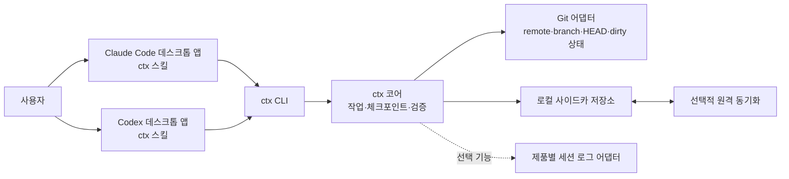

# ctx

`ctx`는 이미 열려 있는 Claude Code와 Codex 데스크톱 앱 사이에서 개발 작업의 컨텍스트를 이어 주는 로컬 우선 시스템이다. 각 앱에 설치한 스킬이 공통 `ctx` CLI를 호출하고, CLI가 작업, 체크포인트, Git 상태, 핸드오프 문서를 일관된 형식으로 관리한다.

- 문서 상태: 논의 결과와 초기 구현 기준
- 작성일: 2026-08-03
- 대상 환경: macOS, Git 저장소, Claude Code 및 Codex 데스크톱 앱

이 문서는 대화에서 합의한 제품 원칙과 초기 구현 기본안을 함께 기록한다. 핵심 원칙, 앱 내부 스킬 중심의 사용 흐름, 사이드카 저장소, 자동 작업 ID, Git과 컨텍스트의 분리, 체크포인트 경계, MVP 범위는 합의 사항이다. 명령의 세부 동작, 동기화할 파일의 단위, 플랫폼별 패키징 방식은 구현하면서 검증할 초기 기본안으로 구분한다.

## 1. 해결하려는 문제

다음 두 전환에서도 작업을 다시 설명하지 않고 이어 가는 것이 목표다.

1. 같은 Mac에서 Claude Code와 Codex 사이를 전환한다.
2. 개인 Mac과 회사 Mac 등 서로 다른 장치 사이를 전환한다.

여기서 이어 가는 대상은 원본 대화 전체가 아니라, 개발을 계속하는 데 필요한 구조화된 작업 상태다. 목표, 제약, 결정과 근거, 완료된 내용, 현재 상태, 다음 행동, 검증 결과, 관련 파일, Git 상태를 하나의 핸드오프로 전달한다.

## 2. 핵심 원칙

1. **데스크톱 앱 내부의 스킬이 기본 사용자 인터페이스다.** CLI로 Claude Code나 Codex 앱을 새로 실행하지 않는다.
2. **`ctx` CLI가 유일한 공통 코어다.** 스킬은 사용자 의도를 해석하고 현재 대화의 의미를 정리하며, 저장과 조회 규칙은 CLI가 담당한다.
3. **개인 작업 컨텍스트를 팀 Git 저장소에 넣지 않는다.** 컨텍스트는 저장소 바깥의 사이드카 저장소에서 관리한다.
4. **코드의 정본은 기존 Git이다.** `ctx`는 커밋, 브랜치, 작업 트리 상태를 참조하지만 코드를 대신 동기화하거나 자동으로 병합하지 않는다.
5. **체크포인트는 추가 전용이다.** 기존 기록을 덮어쓰지 않는다. 최초 기록은 부모가 없고, 일반 기록은 부모가 하나이며, 분기 병합 기록은 부모를 둘 이상 가질 수 있다.
6. **의미 있는 핸드오프 시점은 사용자가 결정할 수 있다.** 자동 처리는 기계적 상태 보존을 보조하며, 안정 핸드오프는 명시적 요청을 가장 확실한 경로로 삼는다.
7. **에이전트에는 경로 목록만 반환하지 않는다.** `resume`이 체크포인트에서 만든 결과 전체가 현재 앱의 컨텍스트에 들어가며, 에이전트는 체크포인트의 관련 자료를 필요에 따라 직접 읽는다.

## 3. 시스템 구조



### 구성 요소별 책임

| 구성 요소 | 책임 |
|---|---|
| Claude Code/Codex 스킬 | 사용자 의도 인식, 현재 대화의 의미 요약, CLI 호출, 결과를 에이전트 컨텍스트에 주입 |
| `ctx` CLI | 명령 계약, 저장소 및 작업 식별, 입력 검증, 출력 형식, 종료 코드 |
| `ctx` 코어 | 스키마 버전, 체크포인트 계보, 원자적 저장, 잠금, 중복 제거, 현재 핸드오프 생성 |
| Git 어댑터 | 정규화한 원격 저장소 식별자, 브랜치, HEAD, 변경 파일, 작업 트리 지문 수집 |
| 저장소 어댑터 | 로컬 파일 저장과 선택적 원격 동기화 |
| 세션 로그 어댑터 | 추후 복구와 검색을 위한 선택 기능이며 정본 핸드오프를 만들지는 않음 |

## 4. 데이터 위치와 형식

작업 컨텍스트는 개발 저장소의 `.git` 바깥에 둔다.

```text
~/Library/Application Support/ctx/
  config.yaml
  repos/
    <repo-id>/
      repo.yaml
      tasks/
        <task-id>/
          manifest.yaml
          handoff.md
          checkpoints/
            <checkpoint-id>.json
          runtime/
            snapshots/
              <snapshot-id>.json
            bindings/
```

- `repo.yaml`: 저장소 식별 정보와 알려진 로컬 작업 디렉터리의 매핑
- `manifest.yaml`: 작업 제목, 상태, 별칭, 체크포인트 헤드, 스키마 버전
- `handoff.md`: 안정 체크포인트를 가리키는 얇은 머리말과 고정된 재개 안내문
- `checkpoints/*.json`: 에이전트가 독립적으로 작업을 재개할 수 있는 추가 전용 정본
- `runtime/snapshots/*.json`: Git과 세션에서 자동 수집한 기계적 관측값
- `runtime/bindings/`: 앱별 활성 작업과 세션의 재생성 가능한 로컬 바인딩

JSON 레코드가 교환 규격의 정본이고 Markdown은 파생 표현이다. 체크포인트는 덮어쓰지 않는 작업 이력의 정본이다. 두 장치나 두 에이전트에서 여러 헤드가 생기면 모두 보존하고, `resume`은 사용할 헤드를 선택하게 한다. `manifest.yaml`과 `handoff.md`는 체크포인트에서 다시 만들 수 있어야 한다. 마지막 쓰기 우선 방식으로 다른 체크포인트를 버리지 않는다.

스킬이 `checkpoint`와 `handoff` 명령에 전달하는 캡처 입력은 사이드카에 저장하지 않는다. 이 임시 입력은 `input_version`, `work_status`, `capture`, `context`만 포함하며, CLI가 완성한 체크포인트만 정본으로 저장한다.

정확한 v1 필드, 조건부 규칙, 해시 계산법, 예제는 [ctx v1 스키마](schemas/v1/README.md)를 따른다.

## 5. 저장소와 작업 식별

### `repo-id`

`repo-id`는 로컬 디렉터리 경로가 아니라 정규화한 Git 원격 URL에서 만든다. 따라서 같은 저장소가 장치마다 다른 경로에 있어도 같은 컨텍스트를 찾을 수 있다.

기준 원격은 사용자가 명시적으로 지정한 원격, `origin`, 유일한 `fetch` 원격 순서로 선택한다. 여러 `fetch` 원격이 있는데 `origin`이나 명시적 기준이 없으면 임의로 고르지 않는다. 정규화할 때 호스트 이름을 소문자로 바꾸고 기본 포트, 사용자 부분, 끝의 `/`와 `.git`을 제거한다. SSH의 `git@host:owner/repo.git`와 HTTPS의 `https://host/owner/repo`는 같은 `host/owner/repo` 키로 변환한다. 미러나 이전 원격처럼 경로 자체가 다른 저장소는 `ctx repo alias`로 명시적으로 연결한다.

권장 형식은 읽을 수 있는 저장소 이름과 원격 URL 해시를 조합한 값이다.

```text
payments-api-7f31c92a
```

원격이 없는 저장소에는 로컬 식별자를 자동 발급한다. 나중에 원격 URL이 생기거나 기존 `repo-id`와의 대응 관계가 확인되면 로컬 식별자를 해당 `repo-id`에 연결한다.

### `task-id`

`task-id`는 사용자가 이름을 정하거나 Jira 티켓을 만들 필요 없이 시스템이 ULID로 자동 생성한다.

```text
01K2M7V7FQ8YV6K8M6D2J1A4XZ
```

- 제목은 사람이 알아보기 위한 선택적 설명이다.
- Jira, GitHub Issue 등 외부 티켓 번호는 작업의 별칭으로 연결할 수 있다.
- 브랜치 이름, 작업 트리 경로, 앱 세션 ID는 작업 식별자가 아니라 변경 가능한 메타데이터다.

새 작업을 시작하면 `/ctx-start`, Codex의 대응 스킬 또는 `ctx task create`가 ULID를 발급하고 현재 작업으로 바인딩한다. 사용자가 의미 있는 이름이나 티켓 번호를 직접 만들 필요는 없다.

초기 구현 기본안으로 `resume`은 작업을 만들지 않는다. `checkpoint`나 `handoff`를 호출했는데 활성 작업이 없으면 CLI가 저장소 잠금 안에서 상태를 다시 확인한 뒤 새 작업을 원자적으로 한 번만 생성해 바인딩한다. 이 지연 생성 정책은 MVP에서 실제 앱 사용 흐름을 검증한 뒤 확정한다. 사용자는 `ctx task switch`로 작업을 전환하고 `ctx task close`로 종료할 수 있다.

### 작업 선택 순서의 초기 기본안

`resume`은 다음 순서로 작업을 찾는다.

1. 사용자가 명시한 `task-id` 또는 외부 별칭
2. 현재 저장소에 대한 로컬 활성 작업 바인딩
3. 현재 저장소에서 가장 최근에 사용한 안정 체크포인트가 있는 작업

같은 우선순위의 후보가 여러 개면 임의로 선택하지 않고 후보를 보여 준다.

## 6. 데스크톱 앱에서의 사용 흐름

두 앱은 이미 실행 중이라고 가정한다. 사용자는 자연어로 요청하거나 각 앱이 지원하는 스킬 호출 방식을 사용한다.

### 앱 내부 스킬 진입점

다음 이름은 공통 사용자 의도를 나타낸다. Claude Code에서는 `/ctx-*`, Codex에서는 `$ctx-*` 또는 앱의 스킬 선택 UI로 호출한다. 실제 설치 단위와 표기는 각 플랫폼에서 검증하되, 모든 스킬은 이미 열려 있는 앱 안에서 공통 CLI를 내부적으로 호출한다.

| 사용자 의도 | Claude Code | Codex | 내부 CLI |
|---|---|---|---|
| 새 작업 시작 | `/ctx-start` | `$ctx-start` | `ctx task create` |
| 작업 재개 | `/ctx-resume` | `$ctx-resume` | `ctx resume` |
| 의미 체크포인트 저장 | `/ctx-checkpoint` | `$ctx-checkpoint` | `ctx checkpoint` |
| 다른 에이전트 또는 장치로 넘기기 | `/ctx-handoff` | `$ctx-handoff` | `ctx handoff` |
| 현재 상태 확인 | `/ctx-status` | `$ctx-status` | `ctx status` |

### 작업 재개

예시 요청:

```text
ctx에서 이 저장소의 최근 작업을 이어서 해 줘.
이 작업 ID의 핸드오프를 불러와서 계속해 줘.
```

내부 흐름:

1. 스킬이 현재 작업 디렉터리와 대상 작업을 확인한다.
2. 동기화가 설정되어 있으면 `ctx resume`이 원격 변경을 먼저 가져온다.
3. CLI가 최신 안정 체크포인트와 현재 Git 상태의 차이를 계산한다.
4. 제한된 크기의 Markdown 결과가 도구 출력으로 현재 에이전트 컨텍스트에 들어간다.
5. 에이전트가 체크포인트에 기록된 관련 자료를 필요에 따라 읽고 작업을 계속한다.

CLI는 브랜치를 바꾸거나 패치를 적용하지 않는다. 예상한 Git 상태와 현재 상태가 다르면 그 차이를 먼저 알린다.

### 체크포인트 저장

예시 요청:

```text
여기까지 ctx 체크포인트로 저장해 줘.
현재 결정을 기록해 둬.
```

스킬은 먼저 `ctx resolve`를 호출해 활성 작업과 CLI가 확인한 `repo_id`를 받는다. 그다음 현재 대화에서 다음 의미 정보를 추출한다.

```text
summary, objective, constraints, assumptions, findings,
decisions, progress, next_actions, blockers, open_questions,
validations, relevant_resources
```

스킬은 이 정보를 `input_version`, `work_status`, `capture`, `context`로 구성해 표준 입력으로 전달한다. 컨텍스트의 저장소 참조에는 `resolve`가 반환한 `repo_id`를 그대로 사용한다. CLI는 여기에 작업 및 체크포인트 ID, 부모, 생성 시각, 세션 정보, 저장소, 브랜치, HEAD, 작업 트리 상태와 해시를 직접 추가한다. 전체 변경 목록은 런타임 스냅숏에 저장하고, 체크포인트에는 재개에 필요한 Git 기준점과 의미 있는 관련 자료를 저장한다. 저장이 끝나면 새 체크포인트 ID를 반환한다.

### 다른 에이전트 또는 장치로 핸드오프

예시 요청:

```text
Codex에서 이어갈 수 있게 핸드오프해 줘.
다른 Mac에서 계속할 수 있도록 여기까지 마무리해 둬.
```

`handoff`는 다음을 한 번에 수행한다.

1. 의미 체크포인트를 생성한다.
2. 새 체크포인트를 가리키는 `handoff.md`를 다시 생성한다.
3. 활성 작업 바인딩을 갱신한다.
4. 설정된 경우 원격 동기화를 실행한다.

대상 앱에서 `resume`을 요청하면, 동기화가 설정된 경우 원격 변경을 먼저 가져온 뒤 동일한 작업을 불러온다. 별도의 앱 실행 명령이나 프롬프트 복사 단계는 필요하지 않다.

## 7. 체크포인트 정책

| 종류 | 생성 시점 | 포함 내용 | 용도 |
|---|---|---|---|
| 런타임 스냅숏 | 저장소를 해석하는 모든 `ctx` 명령과 지원되는 앱 훅에서 디바운스하여 자동 생성 | 단일 장치와 작업 사본의 상세 Git 상태, 세션 및 로그 참조 | 예기치 않은 종료 뒤 상태 복구 보조 |
| 의미 체크포인트 | 사용자가 현재 지점을 저장해 달라고 명시적으로 요청할 때 | 자체 완결형 목표, 결정, 진행 상황, 다음 행동, 검증, Git 기준점 | 작업 이력과 재개의 정본 |
| 안정 핸드오프 | 에이전트 또는 장치 전환 전 사용자가 명시적으로 요청할 때 | 완전하고 안정적인 체크포인트를 가리키는 얇은 포인터 | `resume`의 기본 입력 |

자동 갱신은 두 층으로 나눈다.

- MVP는 저장소를 해석하는 모든 `ctx` 명령에서 마지막 런타임 스냅숏과 현재 Git 상태를 비교하고, 상태가 바뀌었으면 새 스냅숏을 저장한다. 따라서 다음 스킬 호출 시점에는 변경된 상태가 새 스냅숏으로 저장된다.
- 앱이 지원하면 `Stop`, `PreCompact`, `SessionEnd` 같은 수명 주기 시점에 디바운스된 `ctx snapshot`을 호출한다. 이 훅은 Git과 세션 메타데이터만 저장하며 대화의 의미를 요약하지 않는다. 모든 에이전트 도구 실행을 가로채는 기능은 전제로 삼지 않는다.
- 대화의 의미를 담는 체크포인트와 안정 핸드오프의 시점은 사용자가 정한다. 스킬은 의미 있는 완료 지점에서 저장을 제안할 수 있지만, 사용자가 요청한 경우에만 생성한다.

각 체크포인트는 `parent_ids`, `purpose`, `stability`, `work_status`, `capture.completeness`를 가진다. 체크포인트는 부모와의 차이만 기록하는 델타가 아니라 그 시점의 전체 상태다. 일반 체크포인트는 부모를 최대 하나 가지며, 분기를 합치는 `purpose: merge` 체크포인트만 부모를 둘 이상 가진다. `resume`의 기본 대상은 `stability: stable`인 헤드다. 두 장치나 두 에이전트가 같은 부모에서 각각 기록하면 분기를 감지하고, 어느 쪽을 이어갈지 사용자가 선택한다.

제품과 세션은 닫힌 열거형 대신 `producer.system`과 `session_refs[].system`의 개방형 식별자로 표현한다. 각 세션은 불투명한 세션 ID와 선택적인 로그 참조를 가질 수 있다. 로그 위치는 저장소 상대 경로, ctx 저장소 상대 경로, 특정 장치의 홈 디렉터리 상대 경로 또는 URI로 표현한다. 로그는 근거 확인과 복구를 위한 보조 자료이며, 로그가 없어도 체크포인트만으로 작업을 재개할 수 있어야 한다.

## 8. CLI 계약

스킬이 안정적으로 호출할 수 있도록 CLI는 비대화형 실행, 멱등성, 안정적인 Markdown 또는 JSON 출력, 명확한 종료 코드를 제공한다.

```bash
ctx task create --cwd . --title "결제 검증 개선" --json
ctx task switch --cwd . --task <task-id> --json
ctx task close --cwd . --task <task-id> --json
ctx resolve --cwd . --client claude --json
ctx resume --cwd . --client codex --format markdown --budget 6000
ctx snapshot --cwd . --client claude --json
ctx checkpoint --cwd . --client claude --purpose progress --input-format json --stdin --json
ctx handoff --cwd . --client claude --target codex --sync --input-format json --stdin --json
ctx status --cwd . --json
ctx export --cwd . --task <task-id> --output <bundle-path> --json
ctx import <bundle-path> --json
ctx sync --cwd . --json
ctx doctor --json
```

출력 규칙:

- `stdout`: 요청한 Markdown 또는 버전이 있는 JSON 데이터만 출력한다.
- `stderr`: 사람이 읽는 진단 메시지를 출력한다.
- 성공 시에는 종료 코드 `0`을, 실패 시에는 실패 종류별로 정해진 0이 아닌 종료 코드를 반환한다.
- `checkpoint`와 `handoff`는 [캡처 입력 스키마](schemas/v1/capture-input.schema.json)에 따라 `input_version`, `work_status`, `capture`, `context`만 표준 입력에서 받는다. `purpose`, `stability`, 작업 및 체크포인트 ID, 부모, 생성 시각, 세션, Git 기준점과 해시는 CLI가 결정한다.
- 캡처 전에 `resolve`를 호출해야 한다. 스킬은 `resolve`가 반환한 저장소 ID만 관련 자료와 검증 항목에 사용하며, CLI는 알 수 없는 저장소 ID를 거부한다.
- `checkpoint`는 의미 입력과 기계적 관측을 합친 최종 `capture.completeness`가 `complete`이면 `stability: stable`, `partial`이면 `stability: draft`로 저장한다. v1에는 이를 덮어쓰는 옵션을 두지 않는다.
- `handoff`는 입력과 기계적 관측을 모두 합친 최종 캡처가 완전할 때만 `purpose: handoff`, `stability: stable` 체크포인트를 저장하고, 같은 트랜잭션에서 대상과 동기화 의도를 반영한 얇은 포인터 레코드를 생성한다. 의미 정보는 핸드오프 레코드가 아니라 새 체크포인트에만 들어간다.
- 작업 ID, 정렬한 부모 ID 집합, 생성 목적, 안정성, 작업 상태, 캡처 상태, `context_digest`와 저장소별 Git 기준점이 모두 같으면 중복 체크포인트를 만들지 않는다. 생성 목적이 다르거나 부모 집합이 다른 체크포인트는 내용이 같아도 별개의 기록으로 보존한다.

`export`와 `import`는 버전이 있는 이식용 번들로 작업 메타데이터와 체크포인트를 내보내고 가져온다. 이는 일반적인 에이전트 재개 경로가 아니라 수동 이전과 백업을 위한 데이터 이동 인터페이스다.

## 9. 핸드오프 문서 계약

`handoff.md`는 의미 컨텍스트를 중복 저장하지 않는다. YAML 머리말은 다음과 같이 특정 체크포인트와 얇은 본문을 식별한다.

```markdown
---
schema_version: 1
record_type: "ctx.handoff"
handoff_id: "01K2M8B9NG79XDB0QAH5G4PMYR"
task_id: "01K2M7V7FQ8YV6K8M6D2J1A4XZ"
checkpoint_id: "01K2M8A3G4D4T2M0W9Z7J3P6BK"
checkpoint_digest: "sha256:..."
generated_at: "2026-08-03T05:30:00Z"
producer:
  actor_type: "cli"
  system: "ctx.cli"
  device_id: "personal-macbook"
  extensions: {}
target:
  system: "com.openai.codex"
  interface: "desktop"
render_profile: "ctx-handoff-markdown-v1"
rendered_body_digest: "sha256:..."
extensions: {}
---

# ctx handoff

Load checkpoint `01K2M8A3G4D4T2M0W9Z7J3P6BK` for task `01K2M7V7FQ8YV6K8M6D2J1A4XZ` through `ctx resume`.
```

본문은 작업 ID와 체크포인트 ID를 이용한 고정 안내문일 뿐이며 의미 정보를 담지 않는다. `ctx resume`이 참조된 체크포인트를 읽어 목표, 결정, 진행 상황, 다음 행동, 검증, Git 기준점과 세션 참조를 현재 앱의 컨텍스트로 반환한다. 관련 자료에는 다음 에이전트가 읽을 가능성이 높은 구현 파일, 문서, 테스트 등을 기록하며, 이를 위한 별도의 경로 조회 API는 만들지 않는다. 정확한 직렬화와 해시 규칙은 [handoff Markdown v1](schemas/v1/handoff-rendering.md)을 따른다.

## 10. Git 저장소와의 관계

이 프로젝트의 핵심은 코드 협업 정보와 개인 작업 컨텍스트를 분리하는 것이다.

| 팀 Git 저장소에 포함 | 사이드카 `ctx` 저장소에 포함 |
|---|---|
| 소스 코드와 테스트 | 개인 작업의 현재 상태 |
| 팀이 합의한 `AGENTS.md`, `CLAUDE.md` | 체크포인트와 핸드오프 |
| ADR, 설계 문서, README | 앱 세션 바인딩과 런타임 스냅숏 |
| 팀이 공유해야 하는 안정 지식 | 선택적 세션 참조 |

따라서 브랜치 분기, 병합, `pull` 때문에 개인 핸드오프 파일이 충돌하지 않는다. `ctx`는 체크포인트에 당시의 브랜치와 HEAD를 기록하고, 재개 시 현재 상태와 비교한다.

- 브랜치가 달라도 작업 ID는 유지된다.
- 병합이나 리베이스로 HEAD가 바뀌면 불일치를 표시하고 핸드오프를 그대로 덮어쓰지 않는다.
- 미커밋 코드는 Git 작업 트리에 남으며 `ctx`가 다른 장치로 운반하지 않는다.
- 원격 장치에서 계속하려면 참조한 커밋과 필요한 코드 상태가 해당 Git 저장소에도 존재해야 한다.

## 11. 동기화 모델

원격 동기화는 선택 기능이다. 설정하지 않으면 모든 데이터는 로컬 사이드카 저장소에만 남는다.

동기화의 중심은 추가 전용 체크포인트와 작업을 식별하는 데 필요한 작은 메타데이터다. `manifest.yaml`과 `handoff.md`는 체크포인트에서 다시 만들 수 있는 파생 자료다. 검색 색인과 런타임 상태도 각 장치에서 다시 만들 수 있어야 한다.

동기화가 설정되어 있으면 `ctx resume`은 작업을 선택하기 전에 원격 변경을 가져온다. 가져오지 못하면 오래된 로컬 상태를 조용히 최신 상태로 간주하지 않고, 로컬 자료를 사용 중임을 결과에 명시한다.

동시에 만들어진 체크포인트는 둘 다 보존한다. 동기화 뒤 여러 헤드가 발견되면 자동으로 하나를 최신 상태로 간주하지 않고 분기 상태로 표시한다.

## 12. 이 저장소에서 개발할 구조

구현 언어를 정하기 전까지 다음 논리 구조를 기준으로 삼는다.

```text
ai-kit/
  README.md
  docs/
  schemas/
  src/
    core/
    cli/
    adapters/
      git/
      storage/
      sync/
      sessions/
  skills/
    shared/
      behavior.md
      references/
    claude/
      ctx-start/
      ctx-resume/
      ctx-checkpoint/
      ctx-handoff/
      ctx-status/
    codex/
      ctx-start/
      ctx-resume/
      ctx-checkpoint/
      ctx-handoff/
      ctx-status/
  tests/
    fixtures/
```

- `skills/shared/`는 두 플랫폼이 따라야 할 공통 행동 명세, 용어, CLI 계약을 담는다.
- `skills/claude/`와 `skills/codex/`는 각 플랫폼에서 실제로 설치할 스킬을 제공한다. 검증 결과에 따라 공통 파일을 참조하거나 생성할 수 있지만, 하나의 `SKILL.md`를 그대로 설치할 수 있다고 전제하지 않는다.
- 코어가 Claude Code나 Codex의 내부 형식을 알지 못하도록 한다.
- 스키마와 저장 형식은 구현 언어와 분리해 버전을 관리한다.

## 13. MVP 범위

### 포함

- Git 원격 기반 `repo-id` 식별과 로컬 경로 매핑
- ULID 기반 작업 자동 생성, 선택, 목록 조회
- 추가 전용 JSON 체크포인트와 얇은 `handoff.md` 생성
- Git 브랜치, HEAD, 변경 파일, 작업 트리 지문 수집 및 비교
- `resume`, `checkpoint`, `handoff`, `status`, `export`, `import`, `sync`, `doctor` CLI
- 공통 행동 명세를 따르는 Claude Code용 및 Codex용 스킬
- `ctx`가 저장소를 해석하는 모든 시점에 생성하는 기계적 런타임 스냅숏과 지원되는 수명 주기 훅
- 선택적 파일 기반 원격 동기화

### 제외

- Claude Code 또는 Codex 앱을 실행하는 런처
- 원본 대화 로그를 정본으로 사용하는 기능
- 원본 대화의 완전한 재현
- 벡터 검색
- 상시 실행 데몬과 별도 GUI
- MCP 서버
- 자동 브랜치 전환, 패치 적용, 코드 병합

제품별 세션 로그 파싱과 MCP는 기본 흐름이 안정된 뒤 복구, 검색 또는 원격 도구 호출이 필요할 때 추가한다.

## 14. 성공 기준

첫 번째 버전은 다음 시나리오를 만족해야 한다.

1. Claude Code에서 사용자가 핸드오프를 요청한다.
2. `ctx`가 작업과 체크포인트를 저장하고 `handoff.md`를 만든다.
3. 이미 열려 있는 Codex에서 사용자가 같은 작업의 재개를 요청한다.
4. 동기화가 설정된 경우 `resume`이 원격 변경을 가져온다.
5. Codex 스킬이 핸드오프가 가리키는 체크포인트를 컨텍스트로 받고 현재 저장소 상태와의 차이를 보여 준다.
6. 사용자는 두 번 이내의 명시적 행동으로 실제 개발 작업을 계속한다.

장치 간 동기화를 설정했다면 동일한 흐름이 다른 Mac에서도 동작해야 한다.

## 15. 구현 순서

1. 정의한 v1 스키마에 맞춰 로컬 사이드카 저장소를 구현한다.
2. Git 저장소 식별과 상태 수집을 구현한다.
3. 작업, 체크포인트, 핸드오프 CLI를 구현한다.
4. `resume`의 Git 상태 비교와 컨텍스트 예산 처리를 구현한다.
5. 공통 행동 명세와 Claude Code용 및 Codex용 스킬을 만든다.
6. 자동 런타임 스냅숏과 `doctor`를 추가한다.
7. 파일 기반 동기화와 분기 감지를 추가한다.
8. 실제 데스크톱 앱 전환 시나리오로 종단 간 검증한다.
