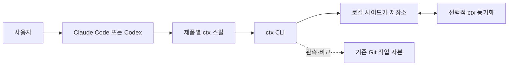

# ctx

`ctx`는 이미 열려 있는 Claude Code와 Codex 사이에서 개발 작업의 의미 있는 상태를 이어 주는 로컬 우선 시스템이다. 각 앱의 스킬이 공통 `ctx` CLI를 호출하고, CLI가 작업·체크포인트·Git 기준점·핸드오프를 일관된 형식으로 관리한다.

> **현재 상태:** v1 JSON Schema, 예제, 해시·렌더링 규격과 검증 스크립트가 있다. CLI, 사이드카 저장소, 동기화 어댑터, Claude Code/Codex 스킬은 아직 구현 대상이다.

## 제품 경계



- **코드의 정본은 Git이다.** ctx는 브랜치를 바꾸거나 패치를 적용하거나 코드를 병합·전송하지 않는다.
- **작업 컨텍스트의 정본은 체크포인트 JSON이다.** 원본 대화나 런타임 스냅숏 없이도 재개할 수 있어야 한다.
- **핸드오프는 안정 체크포인트를 가리키는 얇은 포인터다.** 의미 정보를 중복 저장하지 않는다.
- **개인 컨텍스트는 팀 저장소 밖에 둔다.** 기본 저장 위치는 로컬 사이드카이며 원격 동기화는 선택 사항이다.
- **체크포인트는 추가 전용이다.** 동시 작업으로 여러 헤드가 생기면 모두 보존하고 사용자가 선택하거나 통합한다.

구체적인 사용자 흐름은 [ctx 사용자 시나리오](docs/user-scenarios.md)에 정리되어 있다.

## 시나리오와 구현 진입점

| 사용자 시나리오 | 진입 스킬 | 필요한 CLI 기능 |
|---|---|---|
| 새 작업 시작과 중간 저장 | `ctx-start`, `ctx-checkpoint` | 작업 생성·바인딩, 저장소 해석, Git 관측, 체크포인트 생성 |
| 같은 Mac에서 앱 전환 | `ctx-handoff`, `ctx-resume` | 안정 핸드오프 생성, 체크포인트 선택, Git 기준점 비교, 재개 렌더링 |
| 다른 Mac으로 전환 | `ctx-handoff`, `ctx-resume` | 체크포인트 동기화, 동기화 실패 표시, 장치별 작업 사본 매핑 |
| Git 상태가 다른 곳에서 재개 | `ctx-resume`, `ctx-status` | 브랜치·HEAD·작업 트리 차이 계산과 비파괴적 보고 |
| 두 장치나 에이전트의 동시 작업 | `ctx-resume`, `ctx-checkpoint` | 여러 헤드 감지·선택, 다중 부모 merge 체크포인트 |
| 비정상 종료 뒤 복구 | `ctx-resume`, `ctx-status` | 런타임 스냅숏, 현재 Git 재관측, 마지막 안정 체크포인트와 비교 |

## 필요한 스킬

Claude Code와 Codex에는 같은 사용자 의도를 제공하는 스킬을 각각 설치한다. 제품별 패키지는 공통 행동 계약을 따르되 앱의 실제 스킬 형식과 도구 호출 방식에 맞게 구현한다.

| 공통 의도 | Claude Code | Codex | 책임 |
|---|---|---|---|
| 새 작업 시작 | `/ctx-start` | `$ctx-start` | 현재 저장소를 해석하고 작업을 생성해 현재 앱에 바인딩한다. |
| 작업 재개 | `/ctx-resume` | `$ctx-resume` | 작업과 안정 헤드를 선택하고 전체 재개 결과를 현재 에이전트 컨텍스트에 넣는다. |
| 체크포인트 저장 | `/ctx-checkpoint` | `$ctx-checkpoint` | 대화에서 의미 상태를 캡처하고 기계 상태와 합쳐 새 체크포인트를 만든다. |
| 핸드오프 | `/ctx-handoff` | `$ctx-handoff` | 완전한 안정 체크포인트와 대상 앱을 가리키는 핸드오프를 원자적으로 만든다. |
| 상태 확인 | `/ctx-status` | `$ctx-status` | 활성 작업, 체크포인트 헤드, Git 차이, 동기화 상태를 설명한다. |

별도의 `ctx-sync`, `ctx-snapshot`, `ctx-merge` 사용자 스킬은 MVP에 만들지 않는다.

- 동기화는 `handoff`와 `resume`이 필요할 때 호출한다.
- 런타임 스냅숏은 ctx 명령과 지원되는 앱 수명 주기 훅이 생성한다.
- 여러 헤드 선택은 `resume`, 통합 결과 저장은 `checkpoint`가 담당한다.

### 모든 스킬이 지켜야 할 계약

1. **CLI가 식별자를 결정한다.** 스킬은 경로나 원격 URL에서 `repo_id`, `task_id`, 부모 ID를 추측하지 않는다.
2. **캡처 전에 `ctx resolve`를 호출한다.** 관련 자료와 검증 항목에는 반환된 `repo_id`만 사용한다.
3. **스킬은 의미 정보만 전달한다.** 캡처 입력의 최상위 필드는 `input_version`, `work_status`, `capture`, `context` 네 개다.
4. **CLI가 기계 정보를 추가한다.** 생성 시각, 작업·체크포인트 ID, 부모, 세션, Git 기준점, 작업 트리 지문과 해시는 CLI 책임이다.
5. **재개 결과 전체를 주입한다.** `resume`은 파일 경로 목록만 반환하지 않고 목표, 결정, 진행 상황, 다음 행동, 검증, 관련 자료와 Git 차이를 제한된 Markdown으로 반환한다.
6. **모호성을 숨기지 않는다.** 작업이나 체크포인트 헤드 후보가 여러 개면 임의로 고르지 않고 사용자 선택을 받는다.
7. **Git을 변경하지 않는다.** 스킬과 CLI 모두 자동 checkout, patch 적용, merge를 수행하지 않는다.

## 필요한 CLI 기능

### 명령 목록

| 명령 | 필수 동작 |
|---|---|
| `ctx task create` | ULID 작업을 만들고 현재 저장소·앱에 활성 작업으로 바인딩한다. |
| `ctx task list` | 현재 저장소의 작업과 안정 헤드, 상태, 최근 사용 정보를 조회한다. |
| `ctx task switch` | 명시한 작업을 현재 앱의 활성 작업으로 바인딩한다. |
| `ctx resolve` | 현재 경로에서 `repo_id`, 작업 사본, 활성 작업, 앱 바인딩을 결정한다. |
| `ctx checkpoint` | 캡처 입력과 현재 기계 상태를 검증·결합해 추가 전용 체크포인트를 만든다. |
| `ctx checkpoint --purpose merge --parent ...` | 선택한 여러 헤드를 부모로 갖는 컨텍스트 통합 체크포인트를 만든다. |
| `ctx handoff` | 완전한 캡처만 받아 안정 체크포인트와 얇은 핸드오프를 한 트랜잭션에서 만든다. |
| `ctx resume` | 필요하면 먼저 동기화하고, 작업·헤드를 선택해 Git 차이가 포함된 재개 컨텍스트를 렌더링한다. |
| `ctx status` | 활성 작업, 체크포인트 그래프, 현재 Git 상태, 마지막 스냅숏과 동기화 상태를 조회한다. |
| `ctx snapshot` | Git과 세션의 기계적 관측값만 런타임 스냅숏으로 저장한다. |
| `ctx sync` | 추가 전용 레코드를 교환하고 여러 헤드를 보존한다. 마지막 쓰기 우선으로 체크포인트를 버리지 않는다. |

### CLI 공통 기능

- **저장소 식별:** 기준 Git 원격을 정규화한 `repo_id`와 장치별 로컬 경로를 연결한다. 원격이 없으면 로컬 ID를 발급하고 나중에 명시적으로 연결할 수 있어야 한다.
- **작업 바인딩:** 작업 ID를 브랜치명, 작업 트리 경로, 앱 세션 ID와 분리하고 저장소·앱별 활성 작업을 관리한다.
- **Git 관측:** HEAD, 브랜치, 진행 중인 Git 작업, staged·unstaged·untracked·충돌 상태를 안정적으로 수집한다.
- **상태 비교:** 체크포인트의 Git 기준점과 현재 작업 사본의 차이를 사람이 이해할 수 있게 요약한다.
- **체크포인트 그래프:** 부모 관계, 여러 헤드, merge 체크포인트와 순환 금지 불변식을 관리한다.
- **검증과 해시:** JSON Schema와 의미 불변식을 검사하고 JCS 기반 콘텐츠 해시와 작업 트리 지문을 계산한다.
- **원자성과 멱등성:** 저장소·작업 단위 잠금, 원자적 파일 교체, 중복 판정으로 재시도 시 같은 레코드를 중복 생성하지 않는다.
- **재개 렌더링:** 출력 예산 안에서 자체 완결형 Markdown 또는 버전이 있는 JSON을 만든다.
- **동기화:** 실패를 숨기지 않고 로컬 상태 사용 여부를 표시하며, 충돌한 파생 파일은 정본 체크포인트에서 재생성한다.
- **안정적인 프로세스 계약:** 비대화형 실행을 기본으로 하고 `stdout`에는 요청 데이터만, `stderr`에는 진단만 출력하며 실패 종류별 종료 코드를 사용한다.

## 데이터 계약

| 레코드 | 역할 | 보존 정책 |
|---|---|---|
| 캡처 입력 | 스킬이 CLI에 전달하는 임시 의미 정보 | 저장하지 않음 |
| 런타임 스냅숏 | 단일 장치·작업 사본의 Git 및 세션 관측값 | 추가 전용, 재생성 가능, 동기화 선택 |
| 체크포인트 | 에이전트가 독립적으로 재개할 수 있는 전체 의미 상태와 Git 기준점 | 추가 전용 정본 |
| 핸드오프 | 안정 체크포인트를 가리키는 ID·해시·대상 정보 | 체크포인트에서 검증·재생성 가능 |

중요한 규칙은 다음과 같다.

- 일반 체크포인트는 부모가 최대 하나이고 `purpose: merge`만 부모를 둘 이상 가진다.
- 완전한 캡처는 `stable`, 일부가 생략된 캡처는 `draft`다.
- `handoff`는 `complete`·`stable` 체크포인트만 만들 수 있다.
- 체크포인트는 부모나 원본 로그를 읽지 않아도 이해할 수 있는 전체 상태다.
- 런타임 스냅숏과 세션 로그는 보조 자료이며 의미 컨텍스트를 대신하지 않는다.

정확한 필드와 불변식은 다음 문서가 정본이다.

- [ctx v1 스키마](schemas/v1/README.md)
- [캡처 입력 스키마](schemas/v1/capture-input.schema.json)
- [체크포인트 스키마](schemas/v1/checkpoint.schema.json)
- [런타임 스냅숏 스키마](schemas/v1/runtime-snapshot.schema.json)
- [handoff Markdown v1](schemas/v1/handoff-rendering.md)
- [Git 작업 트리 지문 v1](schemas/v1/worktree-fingerprint.md)

## 저장과 동기화

사이드카 저장소는 개발 저장소의 `.git` 바깥에 둔다. 체크포인트가 정본이며 작업 manifest, 현재 핸드오프, 검색 인덱스와 앱 바인딩은 체크포인트 또는 로컬 상태에서 다시 만들 수 있어야 한다.

장치 간 전환에서는 두 경로가 독립적으로 동작한다.

1. 코드는 사용자가 기존 Git 원격으로 동기화한다.
2. ctx는 설정된 저장소로 체크포인트와 최소 작업 메타데이터를 동기화한다.
3. `resume`은 원격 ctx 변경을 먼저 가져오고 현재 Git 작업 사본과 기준점을 비교한다.

## 구현 순서

1. 스키마 로더, 의미 검증기, JCS 해시와 로컬 추가 전용 저장소
2. Git 저장소 식별, 작업 사본 매핑, 작업 트리 관측과 런타임 스냅숏
3. 작업 수명 주기, 앱 바인딩, 체크포인트 그래프와 중복 제거
4. `resume`, `status`, Git 차이 계산과 컨텍스트 예산 렌더링
5. 안정 핸드오프 렌더링, 파일 기반 동기화와 여러 헤드 처리
6. 공통 스킬 행동 계약과 Claude Code·Codex용 다섯 스킬
7. [여섯 사용자 시나리오](docs/user-scenarios.md)의 종단 간 검증

## 검증

현재 스키마와 예제는 다음 명령으로 검증한다.

```bash
uv run --with jsonschema --with rfc8785 python scripts/validate-schemas.py
```

CLI와 스킬 구현이 추가되면 다음 종단 간 조건을 자동화한다.

- 같은 Mac에서 핸드오프 후 다른 앱이 두 번 이내의 명시적 행동으로 작업을 계속한다.
- 다른 Mac에서 Git과 ctx가 각각 동기화된 경우 같은 작업을 재개한다.
- Git 불일치, 동기화 실패와 여러 헤드를 조용히 무시하지 않는다.
- 비정상 종료 뒤 마지막 안정 체크포인트와 현재 Git 상태를 함께 제시한다.
- 어떤 재개 경로도 Git 작업 사본을 자동 변경하지 않는다.
