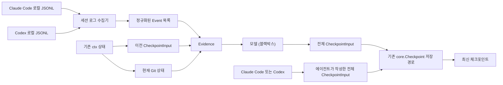

# 자동 체크포인트 설계

이 문서는 Claude Code와 Codex의 로컬 세션 로그를 이용해 체크포인트를 만드는
경로와, 에이전트가 직접 체크포인트를 만드는 기존 경로의 경계를 설명한다.

## 설계 원칙

- `ctx`가 각 앱의 로컬 JSONL 로그를 직접 읽는다. 에이전트 훅을 요구하지 않는다.
- 로그 기반 경로와 에이전트 기반 경로는 같은 `CheckpointInput`과 저장소를 쓴다.
- 자동 경로도 `goal`, `summary`, `decisions`, `next_actions`, `blockers` 전체를 만든다.
- 로그에 없는 비공개 추론은 복원 대상으로 삼지 않는다.
- 모델은 증거를 전체 체크포인트로 재구성하는 블랙박스다.
- 잠금, 백그라운드 데몬, 별도 로그 커서와 모델 통신 규약은 이 단계에서 다루지
  않는다.

## 전체 구조



두 경로의 차이는 `CheckpointInput`을 만드는 주체뿐이다.

| 경로 | 입력 근거 | 장점 | 현재 상태 |
| --- | --- | --- | --- |
| 에이전트 기반 | 에이전트가 현재 대화와 작업 상태를 직접 정리 | 로그에 명시되지 않은 결정이나 의도를 더 자세히 기록할 수 있다 | `ctx checkpoint`로 사용 가능 |
| 로그 기반 | 이전 체크포인트, 새 로그 이벤트, 현재 Git 상태 | 별도 훅 없이 관찰 가능한 기록만으로 동작한다 | 수집·저장 파이프라인 구현, 모델과 공개 CLI 미연결 |

## 로그 수집

기본 수집 위치는 다음과 같다.

- Claude Code: `~/.claude/projects/**/*.jsonl`
- Codex: `~/.codex/sessions/**/*.jsonl`

수집기는 현재 Git worktree 또는 그 하위 디렉터리에서 생성된 세션만 선택한다.
이전 체크포인트의 `created_at`보다 늦은 레코드만 읽고 모든 이벤트를 시각순으로
정렬한다. 별도 커서 파일은 만들지 않는다.

앱별 레코드는 다음 공통 이벤트로 정규화한다.

| `kind` | 내용 |
| --- | --- |
| `user_message` | 사용자의 평문 메시지 |
| `assistant_message` | 에이전트의 평문 응답 |
| `assistant_reasoning` | 로그에 평문으로 노출된 추론 또는 추론 요약 |
| `tool_call` | 도구 이름과 입력 |
| `tool_result` | 도구 이름과 출력, Claude Code의 경우 오류 여부 |
| `file_change` | 편집 도구 호출 또는 Codex 패치 적용 결과 |

Claude Code의 빈 추론 블록과 Codex의 `encrypted_content`는 이벤트에 넣지 않는다.
따라서 자동 체크포인트가 사용하는 추론 정보는 각 앱이 로컬 로그에 평문으로
남긴 범위로 제한된다.

## 모델 경계

자동 경로는 모델 제품, 전송 방식, 프롬프트 형식을 정의하지 않고 다음 인터페이스
경계만 둔다.

```go
type Evidence struct {
    Previous   core.CheckpointInput
    Events     []sessionlog.Event
    CurrentGit core.GitState
}

type Reconstructor interface {
    Reconstruct(Evidence) (core.CheckpointInput, error)
}
```

`Reconstructor`는 다섯 체크포인트 필드를 모두 채운 결과를 반환해야 한다. 기존
`core.Checkpoint`가 필수 필드와 문자열 정리를 검증한 뒤 `reason: auto`로 같은
저장소에 기록한다. 새 이벤트가 하나도 없으면 저장하지 않고
`ErrNoNewEvents`를 반환한다.

## 구현 범위와 남은 작업

현재 구현된 범위:

- 두 앱의 로그 발견, worktree·시각 필터링과 공통 이벤트 변환
- Codex의 `custom_tool_call`과 `function_call` 계열 도구 이벤트 처리
- 이전 체크포인트와 현재 Git 상태를 포함한 `Evidence` 구성
- 가짜 `Reconstructor`를 사용한 전체 체크포인트 저장 검증
- 로그가 없을 때 기존 체크포인트를 유지하는 동작

의도적으로 남겨 둔 범위:

- 실제 `Reconstructor` 모델 선택과 호출 방식
- 필드별 생성 규칙과 프롬프트
- 공개 `checkpoint --auto` 명령 연결
- 설치 후 실제 로그를 이용한 end-to-end 동작 확인

실제 모델이 정해지기 전에는 성공할 수 없는 공개 명령을 노출하지 않는다.

## 검증

fixture에는 두 앱의 메시지, 평문 추론, 도구 호출·결과, 파일 변경뿐 아니라 오래된
레코드, 다른 worktree, 빈 추론과 암호화된 추론도 포함한다. 자동 저장 테스트는
`CheckpointInput`의 다섯 필드가 모두 기존 저장 경로를 통해 최신 체크포인트가
되는지 확인한다.

```bash
cd cli
go test ./...
go test -race ./...
go vet ./...
```
