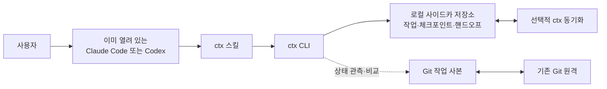
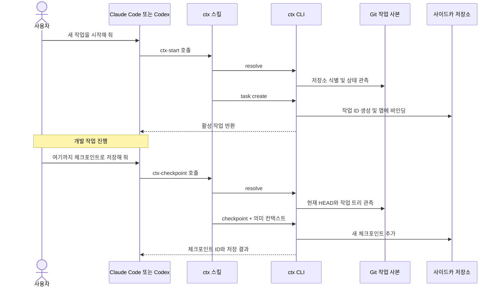
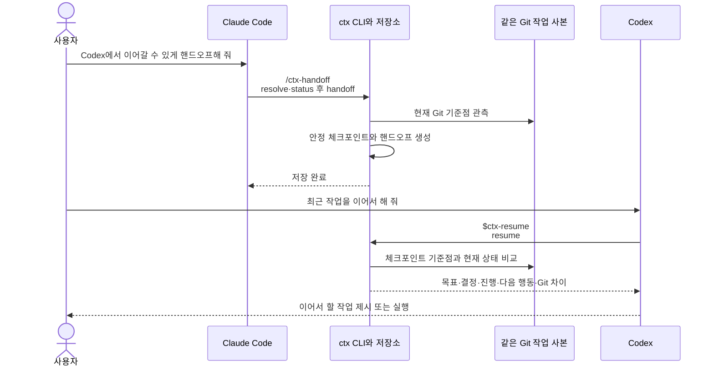
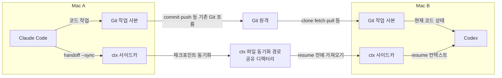
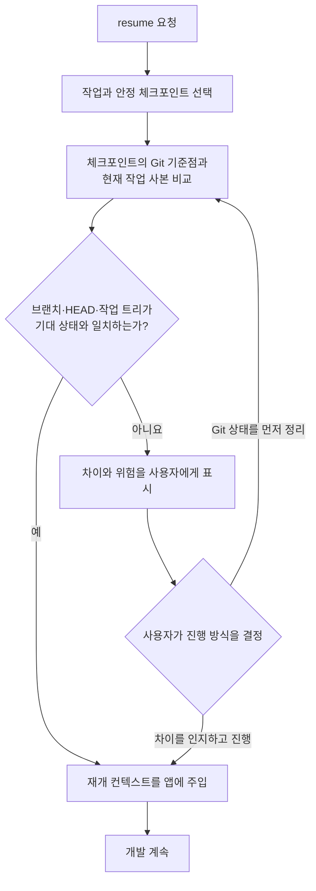
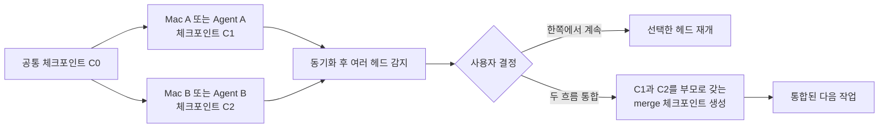
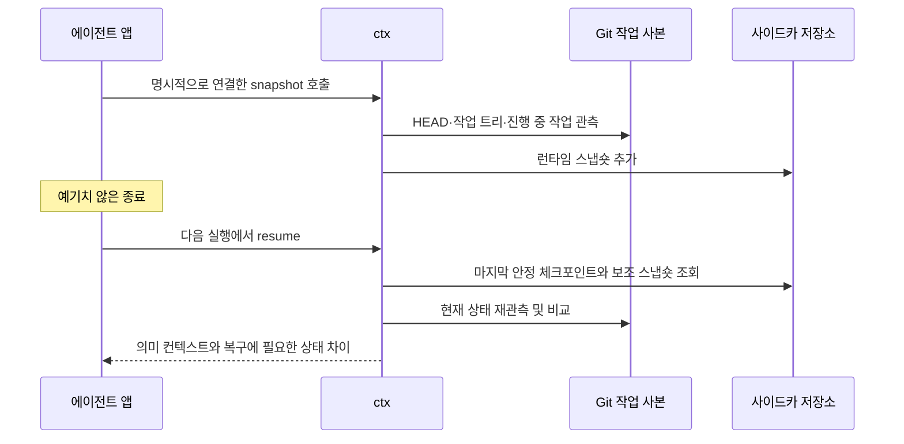

# ctx 사용자 시나리오

`ctx`는 Claude Code와 Codex 사이에서 개발 작업의 **의미 있는 상태**를 이어 주는 로컬 우선 시스템이다. 사용자는 각 앱 안에서 스킬을 호출하고, 공통 `ctx` CLI가 작업·체크포인트·Git 기준점·핸드오프를 관리한다.

> 이 문서는 v1 스키마와 MVP 범위의 **사용 흐름**을 설명한다. 공통 Go CLI와 Claude Code·Codex가 함께 사용하는 다섯 Agent Skills가 구현되어 있으며, 실제 제품 간 종단 간 검증은 다음 단계다.

## 한눈에 보는 역할 분리

두 저장 경로는 서로 다른 문제를 해결한다.

| 대상 | 정본 | ctx가 하는 일 |
|---|---|---|
| 소스 코드와 패치 | 기존 Git 저장소 | 브랜치, HEAD, 변경 상태를 관측하고 비교한다. |
| 목표, 결정, 진행 상황, 다음 행동 | 체크포인트 JSON | 에이전트가 독립적으로 재개할 수 있는 전체 상태를 저장한다. |
| 앱·장치 전환 지점 | 안정 체크포인트와 얇은 핸드오프 | 재개할 체크포인트를 명확히 가리킨다. |
| 순간적인 Git·세션 상태 | 런타임 스냅숏 | 예기치 않은 종료 뒤 상태 확인을 보조한다. |

`ctx`는 코드를 복사하거나 브랜치를 바꾸지 않는다. 장치 간 전환에서는 Git과 ctx 컨텍스트가 각각 동기화되어야 한다.

## 시나리오 1. 새 작업을 시작하고 중간 상태를 저장한다

사용자는 앱 안에서 새 작업을 시작한다. 이후 의미 있는 결정이나 진행 지점을 체크포인트로 남긴다.

- 작업 ID는 자동 발급되며 브랜치명이나 앱 세션 ID와 분리된다.
- 체크포인트는 이전 기록을 덮어쓰지 않는 추가 전용 레코드다.
- 캡처가 완전하면 안정 체크포인트, 일부가 누락되면 초안 체크포인트가 된다.
- 미커밋 코드는 체크포인트에 복제되지 않고 기존 작업 트리에 남는다.

## 시나리오 2. 같은 Mac에서 Claude Code에서 Codex로 전환한다

앱을 새로 실행하거나 프롬프트를 복사하지 않는다. 보내는 앱에서 핸드오프를 만들고, 받는 앱에서 같은 작업을 재개한다.

핸드오프 문서는 작업 내용을 다시 복사한 문서가 아니다. 안정 체크포인트의 ID와 해시를 가리키는 얇은 포인터이며, 실제 재개 컨텍스트는 체크포인트에서 만든다.

## 시나리오 3. 다른 Mac에서 같은 작업을 이어 간다

장치 전환에는 **코드 경로**와 **컨텍스트 경로**가 모두 준비되어야 한다.

두 장치에서 같은 공유 디렉터리를 `CTX_SYNC_REMOTE`로 설정하거나 스킬 호출 때 파일 경로를 제공해야 한다. ctx는 네트워크 서비스나 데이터베이스를 자동으로 구성하지 않는다.

1. Mac A에서 필요한 코드 상태를 기존 Git 흐름으로 원격에 보낸다.
2. `handoff`로 안정 체크포인트를 만들고 ctx 동기화를 수행한다.
3. Mac B에서 Git 작업 사본을 준비한 뒤 `resume`을 요청한다.
4. ctx는 컨텍스트를 불러오고 현재 Git 상태와 핸드오프 기준점의 차이를 보여 준다.

동기화가 실패하면 ctx는 오래된 로컬 상태를 최신 상태처럼 취급하지 않고, 로컬 자료를 사용 중임을 알려야 한다.

## 시나리오 4. 재개하려는 코드 상태가 체크포인트와 다르다

리베이스, 브랜치 변경, 다른 장치의 미반영 커밋처럼 Git 기준점이 달라질 수 있다. ctx는 이 차이를 숨기거나 자동 수정하지 않는다.

- ctx는 자동으로 브랜치를 전환하거나 패치를 적용하거나 코드를 병합하지 않는다.
- 사용자는 Git 상태를 맞춘 뒤 다시 재개하거나, 차이를 인지한 상태에서 현재 코드 기준으로 계속할 수 있다.
- 작업 트리 지문은 상태 비교용이며 미커밋 코드의 백업이 아니다.

## 시나리오 5. 두 장치나 에이전트에서 동시에 진행한다

같은 체크포인트에서 각각 작업하면 체크포인트 이력이 분기된다. ctx는 한쪽을 마지막 쓰기로 덮어쓰지 않는다.

여기서 merge 체크포인트는 **컨텍스트 계보의 통합**이다. 실제 코드 브랜치의 병합은 사용자가 기존 Git 도구로 별도로 수행한다. 한쪽 헤드를 명시해 계속 재개할 수는 있지만, 다른 안정 헤드를 남긴 채 핸드오프하면 받는 쪽의 기본 재개가 다시 모호해진다. 따라서 핸드오프 전에는 사용자가 승인한 merge 체크포인트로 안정 헤드를 하나로 통합한다.

## 시나리오 6. 앱이 예기치 않게 종료된다

`ctx snapshot`을 명시적으로 호출해 둔 경우 런타임 스냅숏은 마지막으로 관측한 기계 상태를 알려 준다. 현재 다섯 Agent Skills는 이 명령을 자동 호출하지 않으며, 예기치 않은 종료 자체가 스냅숏을 생성하지도 않는다. 앱 수명 주기 훅 연결은 실제 제품 종단 간 검증 범위에 남아 있고, 스냅숏은 의미 체크포인트를 대신하지 않는다.

- 마지막 안정 체크포인트 이후의 대화 의미는 런타임 스냅숏만으로 완전히 복원되지 않을 수 있다.
- 런타임 스냅숏과 선택적 세션 로그는 근거 확인과 복구를 돕는 자료다.
- 독립적인 재개의 정본은 항상 자체 완결형 체크포인트다.

## 사용자 의도별 진입점

다섯 Agent Skills의 이름과 호출 방식은 구현되어 있다. [설치 절차](../README.md#설치)는 `ctx` CLI와 두 제품의 사용자 스킬 진입점을 함께 준비하며, Claude Code와 Codex는 같은 스킬 정본을 사용한다.

| 사용자의 말 | Claude Code | Codex | 주요 CLI 흐름 |
|---|---|---|---|
| “새 작업을 시작해 줘.” | `/ctx-start` | `$ctx-start` | `resolve` → `task create` |
| “여기까지 저장해 둬.” | `/ctx-checkpoint` | `$ctx-checkpoint` | `resolve` → `checkpoint` |
| “Codex에서 이어가게 넘겨 줘.” | `/ctx-handoff` | `$ctx-handoff` | `resolve` → `status` → `handoff` |
| “최근 작업을 이어서 해 줘.” | `/ctx-resume` | `$ctx-resume` | 필요시 `sync` → `resume` |
| “현재 ctx 상태를 보여 줘.” | `/ctx-status` | `$ctx-status` | `status` |

`handoff`와 `resume`의 동기화는 사용자가 파일 원격을 제공했거나 `CTX_SYNC_REMOTE`를 설정한 경우에만 수행한다.

## 사용자가 기대해도 되는 것과 아닌 것

| 기대해도 되는 것 | 기대하면 안 되는 것 |
|---|---|
| 목표, 결정, 진행 상황, 다음 행동의 구조화된 전달 | 원본 대화 전체의 재현 |
| 체크포인트 시점과 현재 Git 상태의 차이 확인 | 미커밋 코드의 자동 백업과 장치 간 전송 |
| 여러 체크포인트 헤드의 보존과 명시적 선택 | 충돌 시 임의의 최신 기록 자동 선택 |
| 앱 내부에서 시작·저장·핸드오프·재개 | 앱 실행, 자동 브랜치 전환, 패치 적용, 코드 병합 |

## 관련 규격

- [프로젝트 개요와 MVP 범위](../README.md)
- [ctx 스킬 행동 계약](skill-behavior-contract.md)
- [ctx v1 데이터 계약](../schemas/v1/README.md)
- [handoff Markdown v1](../schemas/v1/handoff-rendering.md)
- [Git 작업 트리 지문 v1](../schemas/v1/worktree-fingerprint.md)
